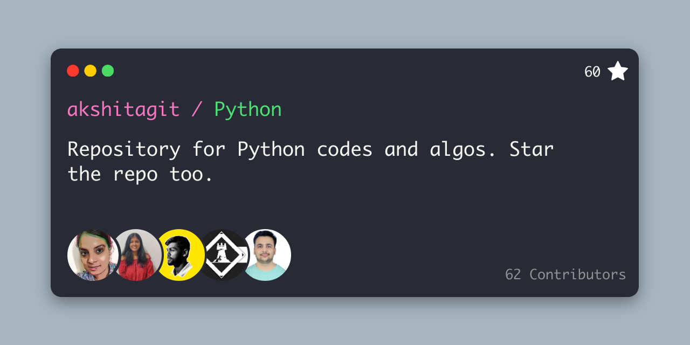

 

# Python
Repository for Python codes and algos. Star the repo too 🚀

Students may contribute algorithms and data structures in a variety of languages to an open repository.

This Repository is meant for everyone to create code and learn to contribute to open source

## Instructions

- Fork this Repository using the button at the top		However, if you are interested in having contributions to this repo count toward Hacktoberfest we encourage you to take a look at this list of Hacktoberfest issues for inspiration and make the necessary changes to focus on enabling people to make meaningful contributions to open source projects.
- Clone your forked repository to your pc ( git clone "url from clone option.)		
- Create a new branch for your modifications (ie. `git branch new-user` and check it out `git checkout new-user` and `git checkout -b new-user`)		
- Add your profile image in `static/images/` ( use drag and drop option or upload by commands.)		
- Add your profile data in `content/participant/`		
- Add your files (`git add -A`), commit (`git commit -m "added myself"`) and push (`git push origin new-user`)		
- Create a pull request		
- Star this repository

### Happy coding!

## ❤️ Project Admin

<table>
	<tr>
		<td align="center">
			<a href="https://github.com/akshitagupta15june">
				
				  <b>AKSHITA GUPTA</b>
			</a>
			  <a href="https://github.com/akshitagupta15june">
		👑 Admin
	    </a>
		</td>
	</tr>
</table>

## 🌟 Contributors

#### Thanks goes to these wonderful people ✨✨:

<table>
	<tr>
		<td>
       
		</td>
	</tr>
</table>
